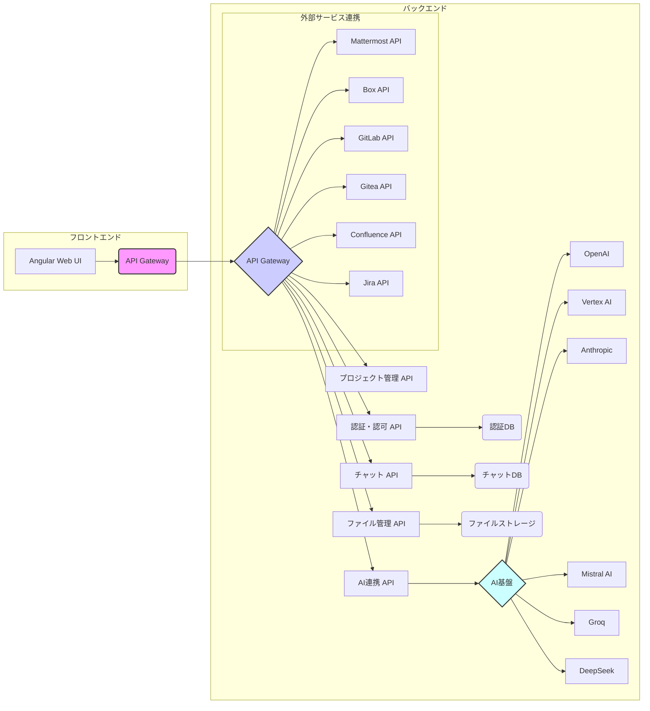

# openai-api-wrapper

## 概要

OpenAI の API をラップして使いやすくしたものです。

## プロジェクト概要

**openai-api-wrapper** は、AI技術を活用した多機能なアプリケーション開発基盤です。
様々なAIモデルの統合、外部サービスとの連携、柔軟な拡張性、フルスタック構成、バッチ・リアルタイム処理対応を特徴とし、高度なAI活用システム開発を効率化することを目指しています。

## 主要機能

* **多様なAIモデル統合:** OpenAI, Vertex AI, Anthropic, Mistral, Groq, DeepSeek など、様々なAIプロバイダーのモデルを統合的に利用可能
* **外部サービス連携:** Box, Mattermost, GitLab, Gitea, Confluence, Jira との連携機能により、業務システムとのスムーズなデータ連携と高度な自動化を実現
* **モジュール性と拡張性:**  機能が独立したモジュールとして実装されており、機能追加やカスタマイズが容易
* **フルスタック構成:** バックエンド (Java/Spring Boot) からフロントエンド (Angular) まで、一貫した技術スタックで開発
* **バッチ・リアルタイム処理:** バッチ処理 (エージェント) とリアルタイム処理 (APIサーバー、チャット機能) の両方をサポート

## アーキテクチャ概要図



## 技術スタック

* **バックエンド:** Java, Spring Boot, TypeORM, PostgreSQL
* **フロントエンド:** TypeScript, Angular, Tailwind CSS
* **AI連携:** OpenAI API, Vertex AI API, Anthropic API, Mistral API, Groq API, DeepSeek API
* **外部サービス連携:** Box API, Mattermost API, GitLab API, Gitea API, Confluence API, Jira API

## 機能

1. **API 生データのロギング**: API の入出力の生データを`history`に保存します。
2. **課金履歴**: 課金履歴を`history.log`に書き込みます。
3. **エージェントとステップ**: 複数ステップからなるエージェントを作成するためのクラスを利用できます。
4. **バッチ/オンライン**: バッチ機能と、REST-API のサーバー機能があります。

## ディレクトリ構造

```markdown
├── README.md
├── history (通信ログが溜まるところ。エラー調査とかに使う。)
│   ├── ...
│   └── ...
├── history.log (課金履歴)
├── package.json
├── prompts_and_responses (投げつけたプロンプトと結果が溜まるところ)
│   ├── (agent name)/ (エージェント毎にディレクトリが分かれている)
│   │   ├── ...
│   │   └── ...
│   └── ...
│       ├── ...
│       └── ...
├── results
├── src （ソースコード）
│   └── app
│   ├── agent
│   │   ├── company-report-from-logos (エージェント定義)
│   │   │   ├── README.md
│   │   │   └── runner.ts
│   │   └── sample (エージェント定義)
│   │   └── runner.ts
│   ├── cli.ts
│   ├── common (共通機能)
│   │   ├── base-step.ts
│   │   ├── fss.ts
│   │   ├── openai-api-wrapper.ts
│   │   └── utils.ts
│   └── main (メイン実行系)
│       ├── main-batch.ts
│       ├── main-generate.ts
│       ├── main-server.ts
│       └── main-vision-plain.ts
└── tsconfig.json
```

## 使用方法

### 事前準備

```bash
# プロキシの設定（必要に応じて）
export https_proxy="http://${username}:${password}@${proxyHost}:${proxyPort}"

# OpenAIのAPI鍵設定
export OPENAI_API_KEY="${YOUR_OPENAI_API_KEY}"

# 必要ライブラリをインストール
npm install
```

### CLI

CLI の使い方は help を参照してください。

```bash
# ヘルプ
npm run cli --help
```

コマンドをインストールする場合。

```bash
# oaw ユーザーのみにインストール
npm link oaw

# oaw グローバルにインストール
npm link
```

### バッチ利用

```bash
# <sample>の部分はエージェント名を入れる。
# src/app/agent配下にあるディレクトリ名がエージェント名なので、そこから選んで使う。
npm run batch sample
```

結果は`prompts_and_responses`に溜まるので、中身見ておくと途中経過が見れてよい。.tmp が作成中ファイル。

`history/`には通信の生データが溜まる。エラー解析とかで使う。
`history.log`は課金履歴が載る。

### オートリビルド

以下のコマンドでプロセスを起動しておくと、ソースコードが変更されるたびに自動でビルドされます。

```bash
npm run start:dev
```

## エージェントの作り方

```bash
# agentNameで名前を指定する
npm run generate <agentName>
```

`src/app/agent/${agentName}`配下に`runner.ts`という名前でひな型が作成されるので、それを元に作る。
※細かいことはひな型のコメントに書いてあります。

## Azure を使う場合

```bash
# Azure OpenAI のエンドポイント
export AZURE_OPENAI_ENDPOINT="${YOUR_AZURE_OPENAI_ENDPOINT}"

# Azure OpenAI のAPI鍵
export AZURE_OPENAI_API_KEY="${YOUR_AZURE_OPENAI_API_KEY}"

# Microsoft のazureライブラリを上書きする。※httpヘッダーが取れない問題に対応するため。
cd node_modules_overwrite
./overwrite.sh
```
